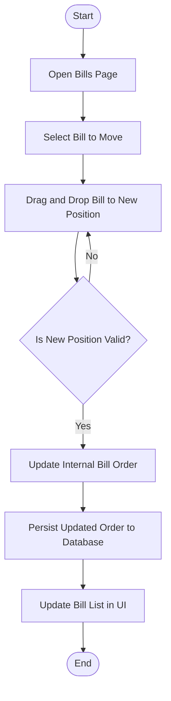
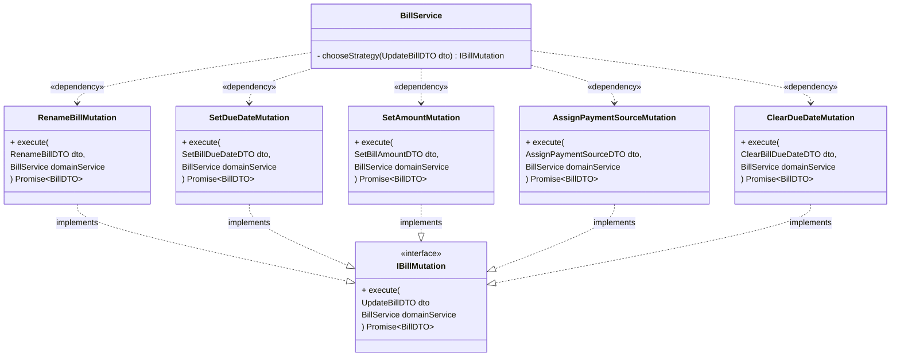

# Project Summary

**Name:** Fin  
**Team:** Walker Smith

## Overview

We're building Fin, a **household financial coordination system**. A single platform where the Bill Organizer, Budget Manager, and Investor can each perform their financial responsibilities efficiently and transparently.

The **core purpose** is to bring clarity, control, and confidence to household money management by centralizing bills, budgets, and payment sources and eventually connecting them to long-term financial goals.

Most budgeting apps treat every user as if they are the same person doing everything; tracking bills, managing budgets, and planning investments. But in many households, these responsibilities are shared and specialized:

- One partner tracks and pays the bills.
- Another manages the budget and spending plan.
- Maybe one also steers long-term investments.

> We're not just building a budgeting app. We're building a household financial operating system that unites partners and helps them divide and conquer with clarity so they can focus on achieving their goals.

## System Capabilities

When completed, the system will provide a web application with a browser-based client and backend API that allows users to record and manage recurring household bills, set due dates, assign payment sources, and calculate total fixed monthly costs. Users will be able to filter bills by time horizon, such as "due this week" or "due next week," to anticipate upcoming obligations. Each bill can be associated with a payment site, allowing quick navigation to external portals for payment submission. Enable managing payment sources to easily see which providers need updating when a card expires. Enable reordering bills for personalized organization. As a stretch goal, the system will support categorizing bills and managing user preferences, enabling a more personalized and flexible user experience.

# Project Requirements

Requirements are marked as in-scope or out-of-scope to convey the long term vision of the product, while also being practical about the scope of the term project.

#### Bill Organizer (focus: logistics, accuracy, payment systems)

1. ✓ As the bill organizer, I can create new bills so that I can maintain a complete record of all recurring payments.
2. ✓ As the bill organizer, I can order my bills so that I can easily prioritize payments.
3. ✓ As the bill organizer, I can set a numerical amount for each bill so that I can calculate the household's total fixed monthly costs.
4. ✓ As the bill organizer, I can categorize my bills so that I can easily review how money is spent at a high level.
5. ✓ As the bill organizer, I can set a due date for each bill so that I can ensure payments are made on time.
6. ✓ As the bill organizer, I can assign a payment source to each bill so that I can quickly identify which payers need updated information when my debit card expires.
7. ✓ As the bill organizer, I can set a payment site so that I can easily be redirect to a providers payment portal.
8. ☐ As the bill organizer, I can manage linked institutions so that the budget manager can see spending habits in real time without knowing what accounts exist and how to access them.

#### Budget Manager (focus: planning, adaptation, reallocation)

1. ✓ As a budget manager, I can view the total cost of all bills so that I can understand our fixed expenses and adjust discretionary budgets accordingly.
2. ☐ As a budget manager, I can adjust bill amounts or categories so that I can simulate how changes will impact our overall budget.
3. ✓ As a budget manager, I can see upcoming due dates so that I can anticipate cash flow needs throughout the month.
4. ✓ As a budget manager, I can manage income sources so that I can establish discretionary budgets
5. ☐ As a budget manager, I can review live transactions across my institutions so that I can evaluate our current spending habits with our plan.

#### Investor (focus: long-term optimization and liquidity awareness)

1. ✓ As an investor, I can see the total monthly bill commitments so that I can advocate for how much cash flow should be allocated toward investments.
2. ☐ As an investor, I can categorize bills by necessity level (essential vs. discretionary) so that I can model different financial risk scenarios.
3. ☐ As an investor, I can view trends in bill growth or reduction so that I can anticipate future cash flow flexibility.
4. ☐ As an investor, I can link my bill and budget data with my investment planning so that I can align short-term obligations with long-term growth goals.

#### Operator (focus: system health, monitoring, troubleshooting)

1. ✓ As an operator, I can use SwaggerUI via ~/swagger route to interface directly with the REST API so that I can explore, test, and document endpoints efficiently without needing separate client tool.
2. ✓ As an operator, I can make an HTTP GET request to /api/Diagnostic/healthcheck so that I can evaluate if the system is healthy.
3. ✓ As an operator, I can make an HTTP GET request to /api/Diagnostic/liveness so that I can determine if the application is alive and able to respond to requests (used for automated restart/health probes).
4. ✓ As an operator, I can make an HTTP GET request to /api/Diagnostic/readiness so that I can determine if the system is ready to handle traffic.
5. ✓ As an operator, I can make an HTTP GET request to /api/Diagnostic/serviceInfo so that I can determine the name of the application, the version number, and environment (dev|prod) for troubleshooting or auditing

# Users and Tasks: Use Cases(Text-based or UML Use Case Diagrams)

## User Personas

There are **three** primary user personas. The bill organizer, the budget manager, and the investor.

### 1. The Bill Organizer

**Primary Goals:**

- Ensure every bill is known, logged, categorized, and paid on time.
- Keep accounts, payment methods, and credentials secure and up to date.
- Minimize disruption from failed or expired payment sources.

**Behavior Patterns:**

- Knows where everything is paid from (accounts, cards, ACH).
- Prioritizes automation and record-keeping accuracy.
- Prefers clarity and structure (lists, due dates, reminders).

**Pain Points:**

- Forgotten logins or disjointed payment systems.
- Duplicate subscriptions or unclear ownership.
- Friction in updating payment methods across vendors.

**Key Product Value:**

> A tool that centralizes bills, payment sources, and due dates — simplifying upkeep and ensuring nothing slips through.

---

### 2. The Budget Manager

**Primary Goals:**

- Maintain a balanced and flexible household budget.
- Allocate funds toward upcoming events or priorities (birthdays, trips, emergencies).
- Ensure spending aligns with shared goals and lifestyle expectations.

**Behavior Patterns:**

- Adjusts categories and buckets dynamically.
- Communicates and negotiates tradeoffs ("let's cut dining out this month to fund gifts").
- Seeks visibility into spending trends and category health.

**Pain Points:**

- Limited visibility into actual bill data (without coordination).
- Tools that don't reflect real-life shifting priorities.
- Difficulty seeing how reallocation decisions affect future bills.

**Key Product Value:**

> A budgeting interface that reacts to life events, allows reallocation, and connects directly to live bill data for accuracy.

---

### 3. The Investor

**Primary Goals:**

- Grow wealth responsibly while managing household risk.
- Align investments with near-term cash flow and long-term goals.
- Optimize tax outcomes and coordinate across accounts.

**Behavior Patterns:**

- Monitors account balances and investment performance.
- Performs periodic portfolio reviews or reallocations.
- Integrates cash management with investment flows (e.g., moving excess savings into ETFs).

**Pain Points:**

- Fragmented view of assets across platforms.
- Hard to reconcile "household cash flow" with "investable funds."
- Tax surprises from reallocation or conversions.

**Key Product Value:**

> A high-level dashboard connecting recurring bills, budgets, and investment cash flow — so decisions in one domain don't blindside another.

---

### Summary: The Financial Household System

| Role               | Focus                 | Strength              | Key Needs                                   |
| ------------------ | --------------------- | --------------------- | ------------------------------------------- |
| **Bill Organizer** | Payments & logistics  | Organization          | Unified tracking, alerts, automation        |
| **Budget Manager** | Planning & adaptation | Strategic flexibility | Category reallocation, forecasting          |
| **Investor**       | Growth & optimization | Analytical insight    | Portfolio visibility, cash flow integration |

## Use Cases

### **Use Case: Record a Bill's Amount for Monthly Tracking**

**Primary Actor:**
Bill Organizer

**Goal:**
Record a recurring bill's name and amount so that the household can estimate total monthly fixed expenses.

**Preconditions:**

- The user has opened the Bills page in the application.
- The system is ready to accept new bill entries (either stored locally or via a connected backend service).

**Postconditions:**

- The new bill is successfully recorded with a valid name and amount.
- The updated bill list reflects the newly added entry.

**Main Flow (Happy Path):**

1. The user selects **"Create New Bill."**
2. The system prompts the user to enter the bill's name.
3. The user enters the bill name (e.g., "Internet").
4. The system creates a new bill record with that name and a default amount of `0.00`.
5. The system prompts for the bill's amount.
6. The user enters the amount (e.g., "85.00").
7. The system validates that the entered value is a valid positive numeric amount.
8. The system updates the bill's record and confirms the change visually by displaying the new total on the bill list.

**Alternate and Exception Flows**

1. E1 – Invalid Amount Format
   - _Condition:_ The user enters a non-numeric, negative, or unrealistic value (e.g., "eighty-five" or "-50").
   - _System Response:_ The system returns an error status (e.g., HTTP 500).
2. E2 – Empty Name Field
   - _Condition:_ The user attempts to proceed without entering a name.
   - _System Response:_ The system returns an error status (e.g., HTTP 500).
3. E3 – Persistence Failure
   - _Condition:_ A network or backend persistence error occurs while saving the bill.
   - _System Response:_ The system returns an error status (e.g., HTTP 500).

---

### **Use Case: Update Bill Due Date**

**Primary Actor:**
Bill Organizer

**Goal:**
Set or update a recurring bill's due date so that the household can track upcoming obligations accurately and anticipate cash flow needs.

**Preconditions:**

- The user has opened the Bills page in the application.
- At least one existing bill is present in the system.
- The system is ready to accept updates to existing bills (either locally or via a connected backend service).

**Postconditions:**

- The bill's due date is successfully updated or cleared.
- The updated bill list reflects the new or cleared due date.

**Main Flow (Happy Path):**

1. The user selects an existing bill from the bill list.
2. The user selects the **Due Date** field.
3. The user selects a day and month for the due date.
4. The user clicks **Set Due Date**.
5. The system validates that the selected day/month combination is a valid date.
6. The system updates the bill record with the new due date.
7. The system persists the updated bill to the database.
8. The system visually confirms the change by updating the bill list with the new due date.

**Alternate and Exception Flows:**

1. E1 – Annual Bill
   - _Condition:_ The user unselects this is a recurring bill option.
   - _System Response:_ The system remove the reoccurring flag from the bill, persists the update to the database, and refreshes the bill list.

2. E1 – Invalid Date
   - _Condition:_ The user selects a day/month combination that does not form a valid date (e.g., February 30).
   - _System Response:_ The system returns an error status (e.g., HTTP 500).

3. E2 – Clear Existing Due Date
   - _Condition:_ The bill already has a due date and the user chooses to remove it.
   - _System Response:_ The system clears the due date from the bill, persists the update to the database, and refreshes the bill list.

4. E3 – Persistence Failure
   - _Condition:_ A network or backend error occurs while saving the updated due date.
   - _System Response:_ The system returns an error status (e.g., HTTP 500).

---

### **Use Case: Reorder Bills**

**Primary Actor:**
Bill Organizer

**Goal:**
Reorder bills in the system so that the user can prioritize or organize them according to their personal preference for easier management and review.

**Preconditions:**

- The user has opened the Bills page in the application.
- At least two bills exist in the system.
- The system is ready to accept updates to existing bills (either locally or via a connected backend service).

**Postconditions:**

- Bills are reordered according to the user's input.
- The updated order is persisted to the database.
- The updated bill list reflects the new order in the UI.

**Main Flow (Happy Path):**

1. The user navigates to the Bills page.
2. The user selects a bill to move.
3. The user drags and drops the bill to the desired position in the list.
4. The system updates the internal ordering of the bills.
5. The system persists the updated order to the database.
6. The system visually confirms the new order by updating the bill list in the UI.

**Alternate and Exception Flows:**

1. E1 – Invalid Reorder Operation
   - _Condition:_ The user attempts to move a bill to an invalid position (e.g., outside the list bounds).
   - _System Response:_ The system ignores the invalid operation.

2. E2 – Persistence Failure
   - _Condition:_ A network or backend error occurs while saving the new bill order.
   - _System Response:_ The system returns an error status (e.g., HTTP 500).

### **Use Case: Delete Payment Source**

**Primary Actor:**
Bill Organizer

**Goal:**
Remove a payment source from the system so that it is no longer available for associating with bills, while ensuring existing bills that reference it are updated appropriately.

**Preconditions:**

- The user has opened the Payment Sources page in the application.
- At least one payment source exists in the system.
- The system is ready to accept updates to payment sources (either locally or via a connected backend service).

**Postconditions:**

- The selected payment source is deleted from the database.
- Any bills previously associated with the deleted payment source have their `paymentSource` field unassigned (set to null or empty).
- The updated payment source list and bill list reflect the changes.

**Main Flow (Happy Path):**

1. The user navigates to the Payment Sources page.
2. The user selects an existing payment source from the list.
3. The user clicks **Delete Payment Source**.
4. The system presents a confirmation modal asking the user to confirm the destructive action.
5. The user confirms the deletion.
6. The system deletes the payment source from the database.
7. The system removes the deleted payment source from all associated bills.
8. The system updates the UI to reflect the removed payment source and the updated bills.

**Alternate and Exception Flows:**

1. E1 – User Cancels Deletion
   - _Condition:_ The user closes or cancels the confirmation modal.
   - _System Response:_ No deletion occurs. The payment source remains assigned to bills, and the UI remains unchanged.

2. E2 – Persistence Failure
   - _Condition:_ A network or backend error occurs while deleting the payment source or updating related bills.
   - _System Response:_ The system returns an error status (e.g., HTTP 500).

---

### **Use Case: Assign a New Payment Source to an Existing Bill**

**Primary Actor:**
Bill Organizer

**Goal:**
Create a new payment source and immediately assign it to an existing bill so that the bill can be tracked with its new source of payment.

**Preconditions:**

- The user has opened the Bills page in the application.
- At least one existing bill is available for selection.
- The system is able to create new payment sources and update bills (connected to backend or local persistence).

**Postconditions:**

- A new payment source record is created and persisted to the database.
- The selected bill's `paymentSourceId` field is updated to reference the newly created payment source.
- The bill's **Payment Source** section in the UI displays the newly assigned payment source.

**Main Flow (Happy Path):**

1. The user navigates to the **Bills** page.
2. The user selects an existing bill from the list.
3. The user clicks on the **Payment Source** field or button.
4. The user chooses **Create a New Payment Source**.
5. The system presents a form requesting payment source details.
6. The user enters a **Payment Source Name**.
7. The user selects a **Payment Source Type** from a dropdown list.
8. The user clicks **Save and Assign Payment Source**.
9. The system validates the input fields (name and type).
10. The system creates a new payment source record in the database.
11. The system updates the selected bill to reference the newly created payment source.
12. The UI refreshes, and the bill's payment source section now displays the newly assigned payment source.

**Alternate and Exception Flows:**

1. E1 – Validation Error
   - _Condition:_ The user submits the form with missing or invalid name/type fields.
   - _System Response:_ The system returns an error status (e.g., HTTP 500).

2. E2 – User Cancels Creation
   - _Condition:_ The user abandons the activity
   - _System Response:_ No payment source is created, and the bill's existing payment source remains unchanged.

3. E3 – Persistence Failure
   - _Condition:_ A network or backend error occurs while creating the new payment source or assigning it to the bill.
   - _System Response:_ The system returns an error status (e.g., HTTP 500).

---

Would you like me to now create the **UML Sequence Diagram** for this use case (similar to your earlier “Delete Payment Source” one, including application, domain, and infra layers)?

# UML Activity or State Diagram

## Create new bill

## Set/Clear Due Dates

## Delete payment source

## Reorder Bills

## Create and Assign Payment Source

# Data Persistence in the Application

The application persists data using MongoDB as the primary storage technology. MongoDB is a document-oriented NoSQL database that supports flexible schema design, making it well suited for evolving domain models and complex aggregates. Data is stored as JSON-like documents within collections, each corresponding to domain aggregates such as bills and payment sources.

The system follows a domain-driven design architecture, ensuring a clear separation between the domain model and the underlying data store. The domain layer defines the entities, value objects, and repository interfaces that express business concepts and rules. This layer is persistence-agnostic and interacts only with repository interfaces rather than concrete implementations.

The infrastructure layer provides concrete implementations of these repository interfaces. It uses MongoDB as the backing persistence mechanism and uses Mongoose as an object-mapping library. This layer also defines database model classes that mirror the structure of the stored documents. Mappers sever as a translation boundary between the domain entities and the database model, allowing the domain to remain entirely decoupled from the persistence technology. The fieldMap definition establishes a consistent contract between the names and data types used in the domain model and those stored in MongoDB collections. This prevents database-specific constructs such as \_id fields or ObjectId types from leaking into the domain layer.

At runtime, repository classes manage database operations such as inserts, updates, deletions, and queries. These repositories use the MongoDB library's client interfaces to establish connections, perform CRUD operations, and handle serialization and deserialization. The infrastructure layer is injected into the domain layer through dependency inversion, meaning that the domain layer depends only on repository abstractions, not their implementations.

To promote architectural flexibility and adherence to the Open/Closed Principle, the system is designed so that the domain and application layers remain closed to modification when alternative infrastructure implementations are introduced. Because these upper layers depend only on repository interfaces rather than concrete classes, a different persistence mechanism can be injected without altering existing business or application logic. As a stretch goal, I plan to implement an alternative in-memory infrastructure layer to demonstrate this concept in practice

# UI Mockups/Sketches

# UML Class Diagram & Pattern Use

## Patterns

Each pattern usage will be highlighted along with the class diagrams. For clarity, the following patterns leveraged:

- Strategy Pattern
- Specification Pattern
- Template Pattern
- Adapter Pattern
- Facade Pattern

### Entities & Value Objects (Domain)

---

### Specification (Domain)

> The **Specification Pattern** is used to encapsulate the business rules for filtering bills by their due dates. Concrete classes implement the `ISpecification<Bill>` interface and the BillService delegates filtering bills to the specification, calling `isSatisfiedBy` on each bill to determine if the criteria is met.

> **Template pattern** is also leveraged in this use case. `BillDueInNWeeksSpecificationBase` defines an algorithm skeleton and subclasses customize `weekOffset` to alter parts of the algorithm.

---

### BillService (Domain)

---

#### Infrastructure Layer

> The **adapter pattern** is used to decouple the domain layer form a specific data persistence technology in the infrastructure layer. The domain layer interfaces with the `IBillRepository` interface to get, update, and delete bills. The `BillRepository` acts as an adapter translating calls from the domain layer to comply with the contracts of the Mongoose interfaces. The BillRepository exists to convert one interface to another so that a client, domain layer, can use it without knowing the underlying implementation.

---

### Application Layer

---

### Bill Mutations

> The `BillService.updateBill()` method receives an `UpdateBillDTO`, which describes what kind of mutation should be applied to a bill. The **Strategy Pattern** is used to encapsulate each operation into its own class implementing the IBillMutation interface.

---

### Unit of Work

---

### Presentation Layer & Interface Layer

> The **facade pattern** is used by the SDK to provide a simplified, high level interface to the underlying HTTP API. The presentation layer can use single methods from the SDK instead of knowing exact HTTP endpoints, HTTP methods, HTTP headers, request body shapes, or query parameters. The SDK acts as a unified interface for set of interfaces exposed by multiple routes/controllers of the web server.

---

### Alternate presentation layer (CLI)

# User Interactions/UML SequenceDiagrams

## Create new bill

## Set Due Date

## Delete Payment Source

(Maybe change to unit of work?) Bill domain rules related to removing the related payment source is encapsulated in the domain at the cost of missing on a more performant approach where the database queries and modifies in a single operation.

## Filter by bills due next week/this week

